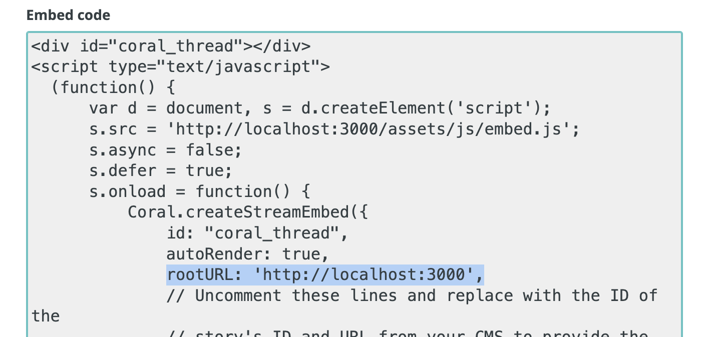
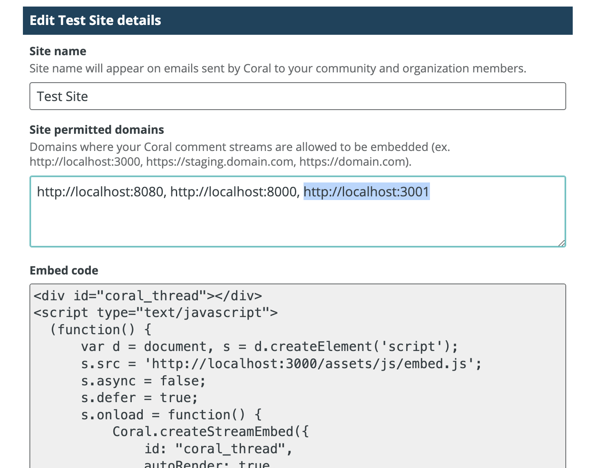
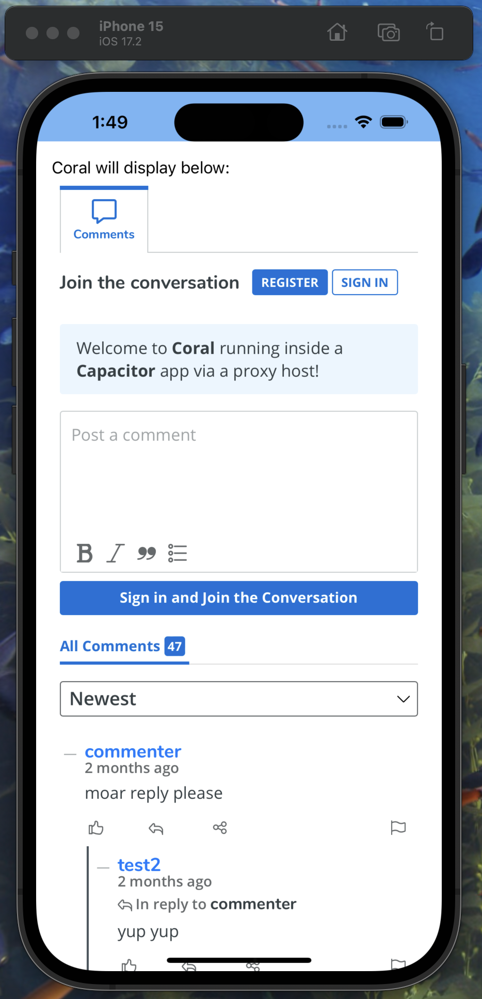

# Coral App Proxy

Coral does not accept the `capacitor://...` url type. As such, it is necessary to "proxy" the page for Coral to make it think it's hosting inside a website.

# How it works

- The App renders an embed pointing to the proxy service running at `http://localhost:3001`
  ```
  <embed src="http://localhost:3001/coral/${storyID}/${encodedStoryURL}" width="100%" height="800px"
  />
  ```
  - `encodedStoryURL` is computed via: `encodeURIComponent(storyURL)`

- The proxy then returns a page with a Coral comment section in it, passing the storyID and storyURL into the embed code pointing to Coral running at `http://localhost:3000` (or whatever Coral URL you're targeting)

- Instead of using `capacitor://...` or similar, you can now use `http://localhost:3001/storyID/encodedStoryURL` for all requests

# Getting it up and running

- Start up the service
  ```
  cd service
  npm i
  npm run start
  ```
- For the Coral instance you want to use, set it in `service/main.js` as the value of `CORAL_URL`
  - `CORAL_URL` should be the value of `rootURL` used when embedding Coral

  

- Add `http://localhost:3001` to the allowed domains for the site you want to proxy inside your Coral Admin under `Configure > Organization > Sites > Details`

  

- Set the `storyID` and `storyURL` you want to use in `app/src/js/capacitor-welcome.js` with the values for the stream you want to embed

- Start up the mobile capacitor app

```
cd app
npm i
npm run build
npx cap add ios
npx cap run ios
```

- With any luck, you should see a Coral embed stream in the simulator

  